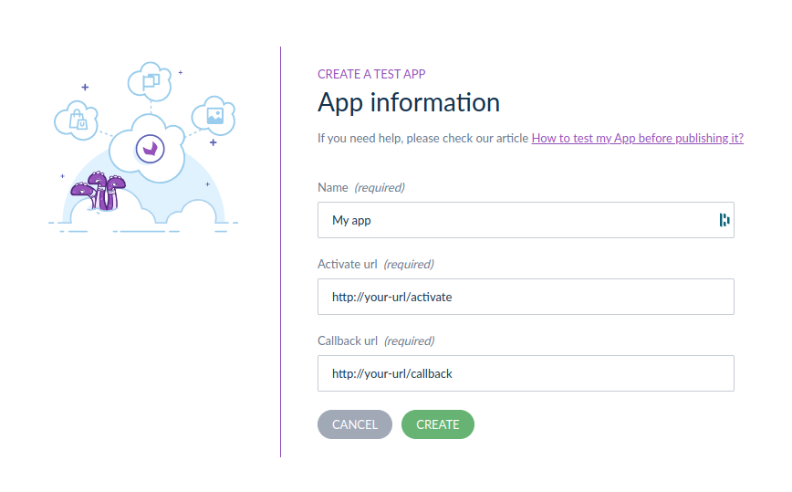
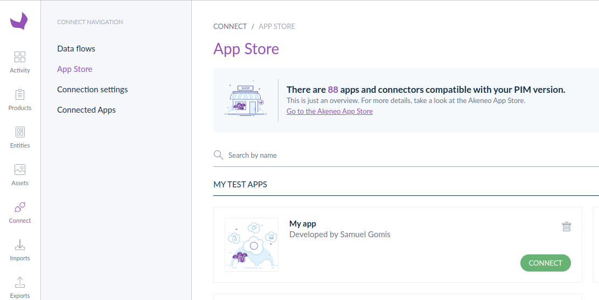
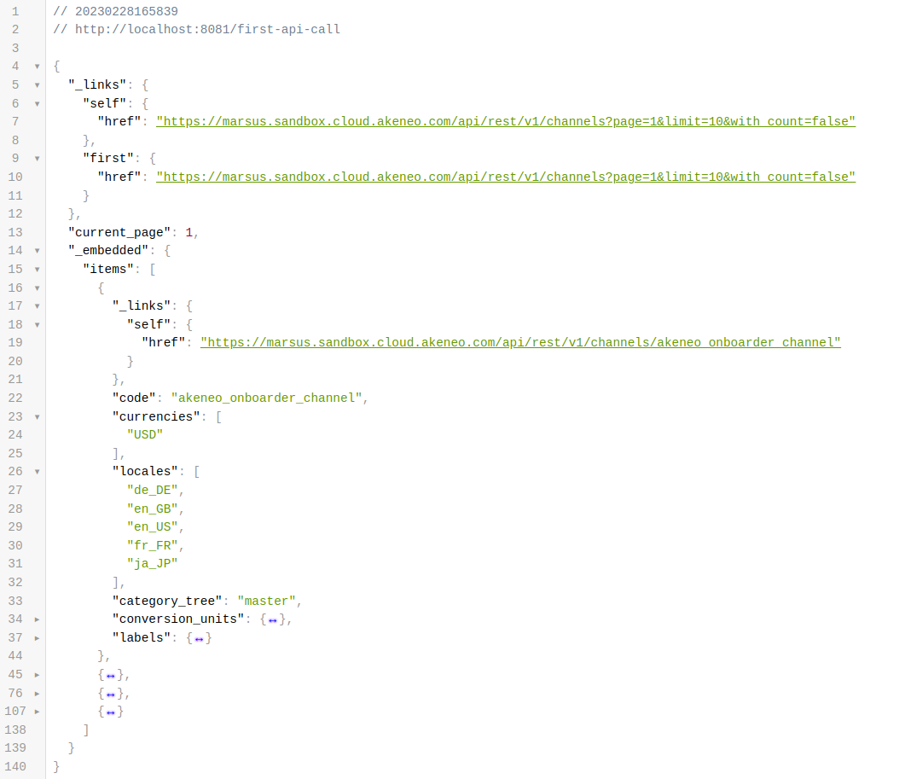

# Start App PHP Symfony

## Requirements
- You’ve got a PIM developer sandbox. If not, please contact us ([https://www.akeneo.com/contact/](https://www.akeneo.com/contact/))
- You’ve installed Docker (20.10.22 or higher)
- You’ve installed Docker Compose V2 plugin (see the official installation tutorial [here](https://docs.docker.com/compose/install/))


### Step 1: Get this App on your local machine
Get the whole Sample-Apps repository and navigate to the PHP Symfony start app folder
```
git clone git@github.com:akeneo/sample-apps.git
cd samples/start-app/php-symfony
```

### Step 2 (optional): Create a tunnel to expose your local App
Use [ngrok]([https://ngrok.com/](https://ngrok.com/)) to create a tunnel that allows your App to be accessed using a unique HTTPS URL. You need to create a ngrok account and auth token to preview your App.
```
ngrok http 8081
```
We recommend to generate an [authtoken](https://dashboard.ngrok.com/get-started/your-authtoken) too. If you do not, you may need to restart the installation and connection process.

If everything goes well the command will output your public URL for your local App :


### Step 3: Declare your local App as a test App in your sandbox to generate credentials
1. In your sandbox go to Connect > App store > Create a test App
2. Paste your callback & activation URLs
```
Name: [My App]
Activate URL: [your-url]/activate
Callback: [your-url]/callback
```


The App generates the credentials. Copy them for later.


### Step 4: Launch your App
Open a terminal at the root of the folder of your App, enter the following command and let us guide you
```
make install
```
For information, this command launch scripts locate into `common/bin/install` in the root folder:

- [checkRequirements.sh](https://github.com/akeneo/sample-apps/blob/main/common/bin/install/checkRequirements.sh)
- [dotEnvFileCreator.sh](https://github.com/akeneo/sample-apps/blob/main/common/bin/install/dotEnvFileCreator.sh)

### Step 5: Activate your test App for your sandbox
1. Back in your sandbox go to Connect > App store
2. You see your App in the section “My App”


3. Click on CONNECT
4. Follow the activation process steps until the end

If everything is good, you should see


It means your App is connected. Well done!

### Step 6: Call your first API endpoint

Last but not least, let’s call the PIM API!
Simply go [here](http://localhost:8081/first-api-call).

You should see



You will find a pre-configured HTTP client [here](https://github.com/akeneo/sample-apps/blob/main/samples/start-app/php-symfony/src/UseCase/FirstApiCall.php) . Feel free to use it for your project.

Voilà! You are ready for developing your App!

### What's next?
- Want to get your PIM data to your App? Have a look to our [guided tutorials](https://api.akeneo.com/tutorials/homepage.html#tags=App%20Workflow)
- Need some tools? Have a look to our [dedicated page](https://api.akeneo.com/apps/app-developer-tools.html): we have, with others, a Postman collection that may you during your development.
